# 🗄️ Informe Arquitectónico de Base de Datos - PIN Platform

> **Clasificación:** Confidencial / Arquitectura de Software
> **Descripción:** Este documento técnico detalla la estructura relacional completa de la plataforma logística PIN. Incluye un Diagrama Entidad-Relación (ERD) generado dinámicamente y un diccionario de datos exhaustivo de grado empresarial para auditoría y desarrollo.

---

## 📊 1. Diagrama Entidad-Relación (ERD)

> **Nota Visual:** El siguiente diagrama utiliza sintaxis *Mermaid.js*. En visualizadores compatibles (como GitHub, GitLab, Notion o VS Code con extensión de Markdown), se renderizará automáticamente como un gráfico vectorial interactivo y profesional.

```mermaid
erDiagram
    Amenity {
        BigAuto id
        Char name
        Char category
    }
    CarrierCompany {
        BigAuto id
        Char dot_number
        Char legal_name
        Char dba_name
        Char carrier_operation
        Char status
        DateTime created_at
    }
    Location {
        BigAuto id
        Char name
        Text address
        Char city
        Char state
        Char zip_code
        Char operator
        Char phone
        Char website
        Decimal latitude
        Decimal longitude
        DateTime created_at
        DateTime updated_at
    }
    TruckStop {
        BigAuto id
        Char name
        Text address
        Char city
        Char state
        Char zip_code
        Char operator
        Char phone
        Char website
        Decimal latitude
        Decimal longitude
        DateTime created_at
        DateTime updated_at
        OneToOne location_ptr
        Char facility_type
        Integer parking_spaces
        Integer diesel_lanes
    }
    TruckStop ||--|| Location : "location_ptr"
    WIMStation {
        BigAuto id
        Char name
        Text address
        Char city
        Char state
        Char zip_code
        Char operator
        Char phone
        Char website
        Decimal latitude
        Decimal longitude
        DateTime created_at
        DateTime updated_at
        OneToOne location_ptr
        Char station_id
        Char direction_of_travel
        Integer number_of_lanes
        Char status
    }
    WIMStation ||--|| Location : "location_ptr"
    AlternativeFuelStation {
        BigAuto id
        Char name
        Text address
        Char city
        Char state
        Char zip_code
        Char operator
        Char phone
        Char website
        Decimal latitude
        Decimal longitude
        DateTime created_at
        DateTime updated_at
        OneToOne location_ptr
        Char fuel_type_code
        Char ev_connector_types
        Boolean is_public
        Char maximum_vehicle_class
        Integer cng_dispenser_num
        Integer ev_dc_fast_count
    }
    AlternativeFuelStation ||--|| Location : "location_ptr"
    TireShop {
        BigAuto id
        Char name
        Text address
        Char city
        Char state
        Char zip_code
        Char operator
        Char phone
        Char website
        Decimal latitude
        Decimal longitude
        DateTime created_at
        DateTime updated_at
        OneToOne location_ptr
        Char brand
        Boolean is_24_hours
    }
    TireShop ||--|| Location : "location_ptr"
    RecyclingFacility {
        BigAuto id
        Char name
        Text address
        Char city
        Char state
        Char zip_code
        Char operator
        Char phone
        Char website
        Decimal latitude
        Decimal longitude
        DateTime created_at
        DateTime updated_at
        OneToOne location_ptr
        Integer population_served
        Decimal tires_recycled_tons
        Decimal tires_generated_tons
    }
    RecyclingFacility ||--|| Location : "location_ptr"
    TransportationStatistic {
        BigAuto id
        Date date
        Integer highway_fatalities
        Integer truck_employment
        Decimal truck_tonnage_index
        Decimal diesel_price
        DateTime created_at
    }
    WeightEnforcementStatistic {
        BigAuto id
        Integer year
        Char state
        BigInteger vehicles_weighed_fixed
        BigInteger vehicles_weighed_wim
        Integer oversize_violations
        Integer overweight_violations
        DateTime created_at
    }
    DatasetUpload {
        BigAuto id
        Char title
        Char dataset_type
        File file
        Char status
        DateTime uploaded_at
        DateTime processed_at
        Text processing_logs
    }
    Truck {
        BigAuto id
        Char vin
        Char plate
        Char brand
        Char model
        Integer year
        Integer num_tires
        ForeignKey carrier
        Char status
        Decimal latitude
        Decimal longitude
        DateTime created_at
        DateTime updated_at
    }
    Truck }o--|| CarrierCompany : "carrier"
    MasterDevice {
        BigAuto id
        Char device_code
        OneToOne truck
        Char firmware_version
        Char sim_card
        Float battery_level
        Float signal_strength
        Char status
        DateTime last_ping
        DateTime created_at
        DateTime updated_at
    }
    MasterDevice ||--|| Truck : "truck"
    TireSensor {
        BigAuto id
        Char sensor_code
        ForeignKey master_device
        Char position
        Char tire_brand
        Date install_date
        Float lifecycle_km
        Float accumulated_km
        Boolean is_active
        DateTime created_at
        DateTime updated_at
    }
    TireSensor }o--|| MasterDevice : "master_device"
    VehicleReading {
        BigAuto id
        ForeignKey master_device
        DateTime timestamp
        Decimal latitude
        Decimal longitude
        Float speed_mph
        Float heading
        Float obd_rpm
        Float obd_fuel_level
        Float accel_x
        Float accel_y
        Float accel_z
        Float battery_voltage
        DateTime created_at
    }
    VehicleReading }o--|| MasterDevice : "master_device"
    TirePositionConfig {
        BigAuto id
        Char position
        Char axle_type
        Float new_tread_depth
        Float warning_tread_depth
        Float critical_tread_depth
        Float target_pressure
        Float target_temperature
        Float max_load
        Float base_lifecycle_miles
        Float base_wear_rate
    }
    TireReading {
        BigAuto id
        ForeignKey sensor
        DateTime timestamp
        Float pressure_psi
        Float temperature_f
        Float vibration_g
        Float estimated_tread_depth
        Float rssi
        Float sensor_battery
        DateTime created_at
    }
    TireReading }o--|| TireSensor : "sensor"
    TireMaintenanceLog {
        BigAuto id
        ForeignKey sensor
        Char maintenance_type
        DateTime timestamp
        Float mileage
        Float tread_before
        Float tread_after
        Text notes
        Decimal cost
        DateTime created_at
    }
    TireMaintenanceLog }o--|| TireSensor : "sensor"
    Driver {
        BigAuto id
        Char first_name
        Char last_name
        Char license_number
        Char license_state
        Char cdl_class
        Date hire_date
        Char status
        DateTime created_at
        DateTime updated_at
    }
    DriverLog {
        BigAuto id
        ForeignKey driver
        ForeignKey truck
        DateTime timestamp
        Char status
        Char location
        Float odometer
        DateTime created_at
    }
    DriverLog }o--|| Driver : "driver"
    DriverLog }o--|| Truck : "truck"
    HOSCompliance {
        BigAuto id
        OneToOne driver
        DateTime cycle_start
        Char cycle_type
        Integer driving_time_today
        Integer on_duty_time_today
        Integer consecutive_driving_time
        Integer hours_7days
        Integer hours_8days
        DateTime last_10h_off
        DateTime last_30min_break
        Boolean is_short_haul
        Boolean adverse_conditions
        Boolean is_compliant
        DateTime last_updated
    }
    HOSCompliance ||--|| Driver : "driver"
    HOSAlert {
        BigAuto id
        ForeignKey driver
        Char alert_type
        Char severity
        Char title
        Text message
        DateTime timestamp
        Char location
        Float current_value
        Float threshold_value
        Char status
    }
    HOSAlert }o--|| Driver : "driver"
    WeightRegulation {
        BigAuto id
        Char state
        Char state_name
        Float federal_gross_limit
        Float state_gross_limit
        Float single_axle_limit
        Float tandem_axle_limit
        Float weight_wear_factor
        Boolean permits_available
    }
    AxleConfiguration {
        BigAuto id
        ForeignKey truck
        Integer axle_number
        Char axle_type
        Float position_ft
        Integer tire_count
        Float max_weight_capacity
        Float current_weight
    }
    AxleConfiguration }o--|| Truck : "truck"
    WeightInspection {
        BigAuto id
        ForeignKey truck
        DateTime timestamp
        Char location
        ForeignKey state
        Char inspection_type
        Float gross_weight
        JSON axle_weights
        Boolean is_overweight
        Text notes
        DateTime created_at
    }
    WeightInspection }o--|| Truck : "truck"
    WeightInspection }o--|| WeightRegulation : "state"
    FleetManager {
        BigAuto id
        OneToOne user
        ForeignKey company
        Char phone
        Boolean is_active
    }
    FleetManager ||--|| User : "user"
    FleetManager }o--|| CarrierCompany : "company"
    Trip {
        BigAuto id
        ForeignKey company
        ForeignKey truck
        ForeignKey driver
        ForeignKey dispatcher
        Char origin_address
        Char destination_address
        DateTime scheduled_start
        DateTime scheduled_end
        DateTime actual_start
        DateTime actual_end
        Char status
        JSON route_data
        DateTime created_at
        DateTime updated_at
    }
    Trip }o--|| CarrierCompany : "company"
    Trip }o--|| Truck : "truck"
    Trip }o--|| Driver : "driver"
    Trip }o--|| FleetManager : "dispatcher"
    TruckStation {
        BigAuto id
        Char name
        Char operator
        Char brand
        Char phone
        Char website
        Boolean has_diesel
        Boolean has_def
        Boolean has_restaurant
        Boolean has_wifi
        Boolean has_showers
        Boolean has_tires
        Boolean has_mechanic
        Integer parking_spaces
        Float latitude
        Float longitude
    }
    TruckStopParking {
        BigAuto id
        ForeignKey station
        Char name
        Integer total_spots
        Float latitude
        Float longitude
    }
    TruckStopParking }o--|| TruckStation : "station"
    HighwayRoute {
        BigAuto id
        Char route_id
        Char route_name
        Char route_type
        Char state
        Float length_km
    }
    AlternativeFuelStation {
        BigAuto id
        Char name
        Char fuel_type
        Boolean is_hd_fuel
        Char access_type
        Char operators
        Float latitude
        Float longitude
    }
    RecyclingCenter {
        BigAuto id
        Char name
        Float capacity_tons
        Char recycling_type
        Boolean accepts_tires
        Float latitude
        Float longitude
    }
    WIMStation {
        BigAuto id
        Char name
        Char station_code
        Char direction
        Float latitude
        Float longitude
    }
    SizeWeightRegulation {
        BigAuto id
        Char state
        Float max_weight_lbs
        Float max_length_ft
        Float max_width_in
        Float max_height_ft
    }
    Carrier {
        BigAuto id
        Char dot_number
        Char legal_name
        Char dba_name
        Char entity_type
        Integer num_power_units
        Integer num_drivers
        Char state
    }
    MonthlyTransportIndicator {
        BigAuto id
        Date date
        Char indicator_name
        Float value
        Char unit
        Char region
    }
    Alert {
        BigAuto id
        ForeignKey truck
        ForeignKey sensor
        Char alert_type
        Char severity
        Char title
        Text message
        Float trigger_value
        Float threshold_value
        Char unit
        Char location
        DateTime timestamp
        Char status
        DateTime acknowledged_at
        DateTime resolved_at
        Text resolution_notes
    }
    Alert }o--|| Truck : "truck"
    Alert }o--|| TireSensor : "sensor"
    Recommendation {
        BigAuto id
        ForeignKey alert
        ForeignKey truck
        Char rec_type
        Integer priority
        Char target_name
        Char target_address
        Float latitude
        Float longitude
        Float distance_km
        Integer estimated_time_min
        Float estimated_cost_usd
        Text reason
        Char status
        DateTime created_at
    }
    Recommendation }o--|| Alert : "alert"
    Recommendation }o--|| Truck : "truck"
    Prediction {
        BigAuto id
        ForeignKey truck
        Char model_name
        JSON prediction_data
        Float confidence_score
        DateTime timestamp
        Boolean is_validated
    }
    Prediction }o--|| Truck : "truck"
    User {
        Auto id
        Char password
        DateTime last_login
        Boolean is_superuser
        Char username
        Char first_name
        Char last_name
        Char email
        Boolean is_staff
        Boolean is_active
        DateTime date_joined
    }
```

---

## 📖 2. Diccionario de Datos (Estructuras de Tablas)

A continuación se detalla cada tabla de la base de datos relacional, con sus respectivos tipos de datos, restricciones y llaves foráneas.

### 🗂️ Tabla: `core_amenity`

- **Entidad de Negocio:** `Amenity`
- **Módulo / Microservicio:** `Core`
- **Descripción:** Representa amenity / service dentro de la plataforma.

| Campo / Atributo | Tipo SQL (Django) | ¿Permite Nulo? | ¿Único? | Relación (Foreign Key) | Descripción de Negocio |
|------------------|-------------------|----------------|---------|------------------------|------------------------|
| **`id`** | `BigAuto` | ❌ No | ✅ Sí | - | 🔑 Llave Primaria (Primary Key). Id |
| **`name`** | `Varchar(100)` | ❌ No | ✅ Sí | - | Nombre de amenidad |
| **`category`** | `Varchar(100)` | ✅ Sí | ❌ No | - | Categoría |

 

### 🗂️ Tabla: `core_carriercompany`

- **Entidad de Negocio:** `CarrierCompany`
- **Módulo / Microservicio:** `Core`
- **Descripción:** Representa carrier company dentro de la plataforma.

| Campo / Atributo | Tipo SQL (Django) | ¿Permite Nulo? | ¿Único? | Relación (Foreign Key) | Descripción de Negocio |
|------------------|-------------------|----------------|---------|------------------------|------------------------|
| **`id`** | `BigAuto` | ❌ No | ✅ Sí | - | 🔑 Llave Primaria (Primary Key). Id |
| **`dot_number`** | `Varchar(50)` | ❌ No | ✅ Sí | - | Dot number |
| **`legal_name`** | `Varchar(255)` | ❌ No | ❌ No | - | Legal name |
| **`dba_name`** | `Varchar(255)` | ✅ Sí | ❌ No | - | Dba name |
| **`carrier_operation`** | `Varchar(100)` | ✅ Sí | ❌ No | - | Carrier operation |
| **`status`** | `Varchar(50)` | ❌ No | ❌ No | - | Status |
| **`created_at`** | `DateTime` | ❌ No | ❌ No | - | Created at |

 

### 🗂️ Tabla: `core_location`

- **Entidad de Negocio:** `Location`
- **Módulo / Microservicio:** `Core`
- **Descripción:** Representa location dentro de la plataforma.

| Campo / Atributo | Tipo SQL (Django) | ¿Permite Nulo? | ¿Único? | Relación (Foreign Key) | Descripción de Negocio |
|------------------|-------------------|----------------|---------|------------------------|------------------------|
| **`id`** | `BigAuto` | ❌ No | ✅ Sí | - | 🔑 Llave Primaria (Primary Key). Id |
| **`name`** | `Varchar(255)` | ❌ No | ❌ No | - | Name |
| **`address`** | `Text` | ✅ Sí | ❌ No | - | Address |
| **`city`** | `Varchar(100)` | ✅ Sí | ❌ No | - | City |
| **`state`** | `Varchar(50)` | ✅ Sí | ❌ No | - | State |
| **`zip_code`** | `Varchar(20)` | ✅ Sí | ❌ No | - | Zip code |
| **`operator`** | `Varchar(255)` | ❌ No | ❌ No | - | Operator |
| **`phone`** | `Varchar(50)` | ❌ No | ❌ No | - | Phone |
| **`website`** | `Varchar(500)` | ✅ Sí | ❌ No | - | Website |
| **`latitude`** | `Decimal` | ✅ Sí | ❌ No | - | Latitude |
| **`longitude`** | `Decimal` | ✅ Sí | ❌ No | - | Longitude |
| **`created_at`** | `DateTime` | ❌ No | ❌ No | - | Created at |
| **`updated_at`** | `DateTime` | ❌ No | ❌ No | - | Updated at |

 

### 🗂️ Tabla: `core_truckstop`

- **Entidad de Negocio:** `TruckStop`
- **Módulo / Microservicio:** `Core`
- **Descripción:** Representa truck stop dentro de la plataforma.

| Campo / Atributo | Tipo SQL (Django) | ¿Permite Nulo? | ¿Único? | Relación (Foreign Key) | Descripción de Negocio |
|------------------|-------------------|----------------|---------|------------------------|------------------------|
| **`id`** | `BigAuto` | ❌ No | ✅ Sí | - | 🔑 Llave Primaria (Primary Key). Id |
| **`name`** | `Varchar(255)` | ❌ No | ❌ No | - | Name |
| **`address`** | `Text` | ✅ Sí | ❌ No | - | Address |
| **`city`** | `Varchar(100)` | ✅ Sí | ❌ No | - | City |
| **`state`** | `Varchar(50)` | ✅ Sí | ❌ No | - | State |
| **`zip_code`** | `Varchar(20)` | ✅ Sí | ❌ No | - | Zip code |
| **`operator`** | `Varchar(255)` | ❌ No | ❌ No | - | Operator |
| **`phone`** | `Varchar(50)` | ❌ No | ❌ No | - | Phone |
| **`website`** | `Varchar(500)` | ✅ Sí | ❌ No | - | Website |
| **`latitude`** | `Decimal` | ✅ Sí | ❌ No | - | Latitude |
| **`longitude`** | `Decimal` | ✅ Sí | ❌ No | - | Longitude |
| **`created_at`** | `DateTime` | ❌ No | ❌ No | - | Created at |
| **`updated_at`** | `DateTime` | ❌ No | ❌ No | - | Updated at |
| **`location_ptr`** | `OneToOne` | ❌ No | ✅ Sí | 🔗 `Location` | 🔑 Llave Primaria (Primary Key). Location ptr |
| **`facility_type`** | `Varchar(100)` | ✅ Sí | ❌ No | - | Facility type |
| **`parking_spaces`** | `Integer` | ❌ No | ❌ No | - | Parking spaces |
| **`diesel_lanes`** | `Integer` | ❌ No | ❌ No | - | Islas diésel tractomulas |

 

### 🗂️ Tabla: `core_wimstation`

- **Entidad de Negocio:** `WIMStation`
- **Módulo / Microservicio:** `Core`
- **Descripción:** Representa wim station dentro de la plataforma.

| Campo / Atributo | Tipo SQL (Django) | ¿Permite Nulo? | ¿Único? | Relación (Foreign Key) | Descripción de Negocio |
|------------------|-------------------|----------------|---------|------------------------|------------------------|
| **`id`** | `BigAuto` | ❌ No | ✅ Sí | - | 🔑 Llave Primaria (Primary Key). Id |
| **`name`** | `Varchar(255)` | ❌ No | ❌ No | - | Name |
| **`address`** | `Text` | ✅ Sí | ❌ No | - | Address |
| **`city`** | `Varchar(100)` | ✅ Sí | ❌ No | - | City |
| **`state`** | `Varchar(50)` | ✅ Sí | ❌ No | - | State |
| **`zip_code`** | `Varchar(20)` | ✅ Sí | ❌ No | - | Zip code |
| **`operator`** | `Varchar(255)` | ❌ No | ❌ No | - | Operator |
| **`phone`** | `Varchar(50)` | ❌ No | ❌ No | - | Phone |
| **`website`** | `Varchar(500)` | ✅ Sí | ❌ No | - | Website |
| **`latitude`** | `Decimal` | ✅ Sí | ❌ No | - | Latitude |
| **`longitude`** | `Decimal` | ✅ Sí | ❌ No | - | Longitude |
| **`created_at`** | `DateTime` | ❌ No | ❌ No | - | Created at |
| **`updated_at`** | `DateTime` | ❌ No | ❌ No | - | Updated at |
| **`location_ptr`** | `OneToOne` | ❌ No | ✅ Sí | 🔗 `Location` | 🔑 Llave Primaria (Primary Key). Location ptr |
| **`station_id`** | `Varchar(50)` | ❌ No | ✅ Sí | - | Station id |
| **`direction_of_travel`** | `Varchar(10)` | ✅ Sí | ❌ No | - | Direction of travel |
| **`number_of_lanes`** | `Integer` | ❌ No | ❌ No | - | Number of lanes |
| **`status`** | `Varchar(50)` | ❌ No | ❌ No | - | Status |

 

### 🗂️ Tabla: `core_alternativefuelstation`

- **Entidad de Negocio:** `AlternativeFuelStation`
- **Módulo / Microservicio:** `Core`
- **Descripción:** Representa alternative fuel station dentro de la plataforma.

| Campo / Atributo | Tipo SQL (Django) | ¿Permite Nulo? | ¿Único? | Relación (Foreign Key) | Descripción de Negocio |
|------------------|-------------------|----------------|---------|------------------------|------------------------|
| **`id`** | `BigAuto` | ❌ No | ✅ Sí | - | 🔑 Llave Primaria (Primary Key). Id |
| **`name`** | `Varchar(255)` | ❌ No | ❌ No | - | Name |
| **`address`** | `Text` | ✅ Sí | ❌ No | - | Address |
| **`city`** | `Varchar(100)` | ✅ Sí | ❌ No | - | City |
| **`state`** | `Varchar(50)` | ✅ Sí | ❌ No | - | State |
| **`zip_code`** | `Varchar(20)` | ✅ Sí | ❌ No | - | Zip code |
| **`operator`** | `Varchar(255)` | ❌ No | ❌ No | - | Operator |
| **`phone`** | `Varchar(50)` | ❌ No | ❌ No | - | Phone |
| **`website`** | `Varchar(500)` | ✅ Sí | ❌ No | - | Website |
| **`latitude`** | `Decimal` | ✅ Sí | ❌ No | - | Latitude |
| **`longitude`** | `Decimal` | ✅ Sí | ❌ No | - | Longitude |
| **`created_at`** | `DateTime` | ❌ No | ❌ No | - | Created at |
| **`updated_at`** | `DateTime` | ❌ No | ❌ No | - | Updated at |
| **`location_ptr`** | `OneToOne` | ❌ No | ✅ Sí | 🔗 `Location` | 🔑 Llave Primaria (Primary Key). Location ptr |
| **`fuel_type_code`** | `Varchar(20)` | ❌ No | ❌ No | - | Fuel type code |
| **`ev_connector_types`** | `Varchar(255)` | ✅ Sí | ❌ No | - | Ev connector types |
| **`is_public`** | `Boolean` | ❌ No | ❌ No | - | Is public |
| **`maximum_vehicle_class`** | `Varchar(50)` | ✅ Sí | ❌ No | - | Clase máxima de vehículo |
| **`cng_dispenser_num`** | `Integer` | ❌ No | ❌ No | - | Número de islas cng |
| **`ev_dc_fast_count`** | `Integer` | ❌ No | ❌ No | - | Número de islas ev rápidas |

 

### 🗂️ Tabla: `core_tireshop`

- **Entidad de Negocio:** `TireShop`
- **Módulo / Microservicio:** `Core`
- **Descripción:** Representa tire shop dentro de la plataforma.

| Campo / Atributo | Tipo SQL (Django) | ¿Permite Nulo? | ¿Único? | Relación (Foreign Key) | Descripción de Negocio |
|------------------|-------------------|----------------|---------|------------------------|------------------------|
| **`id`** | `BigAuto` | ❌ No | ✅ Sí | - | 🔑 Llave Primaria (Primary Key). Id |
| **`name`** | `Varchar(255)` | ❌ No | ❌ No | - | Name |
| **`address`** | `Text` | ✅ Sí | ❌ No | - | Address |
| **`city`** | `Varchar(100)` | ✅ Sí | ❌ No | - | City |
| **`state`** | `Varchar(50)` | ✅ Sí | ❌ No | - | State |
| **`zip_code`** | `Varchar(20)` | ✅ Sí | ❌ No | - | Zip code |
| **`operator`** | `Varchar(255)` | ❌ No | ❌ No | - | Operator |
| **`phone`** | `Varchar(50)` | ❌ No | ❌ No | - | Phone |
| **`website`** | `Varchar(500)` | ✅ Sí | ❌ No | - | Website |
| **`latitude`** | `Decimal` | ✅ Sí | ❌ No | - | Latitude |
| **`longitude`** | `Decimal` | ✅ Sí | ❌ No | - | Longitude |
| **`created_at`** | `DateTime` | ❌ No | ❌ No | - | Created at |
| **`updated_at`** | `DateTime` | ❌ No | ❌ No | - | Updated at |
| **`location_ptr`** | `OneToOne` | ❌ No | ✅ Sí | 🔗 `Location` | 🔑 Llave Primaria (Primary Key). Location ptr |
| **`brand`** | `Varchar(100)` | ✅ Sí | ❌ No | - | Brand |
| **`is_24_hours`** | `Boolean` | ❌ No | ❌ No | - | Is 24 hours |

 

### 🗂️ Tabla: `core_recyclingfacility`

- **Entidad de Negocio:** `RecyclingFacility`
- **Módulo / Microservicio:** `Core`
- **Descripción:** Representa recycling facility dentro de la plataforma.

| Campo / Atributo | Tipo SQL (Django) | ¿Permite Nulo? | ¿Único? | Relación (Foreign Key) | Descripción de Negocio |
|------------------|-------------------|----------------|---------|------------------------|------------------------|
| **`id`** | `BigAuto` | ❌ No | ✅ Sí | - | 🔑 Llave Primaria (Primary Key). Id |
| **`name`** | `Varchar(255)` | ❌ No | ❌ No | - | Name |
| **`address`** | `Text` | ✅ Sí | ❌ No | - | Address |
| **`city`** | `Varchar(100)` | ✅ Sí | ❌ No | - | City |
| **`state`** | `Varchar(50)` | ✅ Sí | ❌ No | - | State |
| **`zip_code`** | `Varchar(20)` | ✅ Sí | ❌ No | - | Zip code |
| **`operator`** | `Varchar(255)` | ❌ No | ❌ No | - | Operator |
| **`phone`** | `Varchar(50)` | ❌ No | ❌ No | - | Phone |
| **`website`** | `Varchar(500)` | ✅ Sí | ❌ No | - | Website |
| **`latitude`** | `Decimal` | ✅ Sí | ❌ No | - | Latitude |
| **`longitude`** | `Decimal` | ✅ Sí | ❌ No | - | Longitude |
| **`created_at`** | `DateTime` | ❌ No | ❌ No | - | Created at |
| **`updated_at`** | `DateTime` | ❌ No | ❌ No | - | Updated at |
| **`location_ptr`** | `OneToOne` | ❌ No | ✅ Sí | 🔗 `Location` | 🔑 Llave Primaria (Primary Key). Location ptr |
| **`population_served`** | `Integer` | ✅ Sí | ❌ No | - | Population served |
| **`tires_recycled_tons`** | `Decimal` | ✅ Sí | ❌ No | - | Tires recycled tons |
| **`tires_generated_tons`** | `Decimal` | ✅ Sí | ❌ No | - | Tires generated tons |

 

### 🗂️ Tabla: `core_transportationstatistic`

- **Entidad de Negocio:** `TransportationStatistic`
- **Módulo / Microservicio:** `Core`
- **Descripción:** Representa transportation statistic dentro de la plataforma.

| Campo / Atributo | Tipo SQL (Django) | ¿Permite Nulo? | ¿Único? | Relación (Foreign Key) | Descripción de Negocio |
|------------------|-------------------|----------------|---------|------------------------|------------------------|
| **`id`** | `BigAuto` | ❌ No | ✅ Sí | - | 🔑 Llave Primaria (Primary Key). Id |
| **`date`** | `Date` | ❌ No | ✅ Sí | - | Date |
| **`highway_fatalities`** | `Integer` | ✅ Sí | ❌ No | - | Highway fatalities |
| **`truck_employment`** | `Integer` | ✅ Sí | ❌ No | - | Truck employment |
| **`truck_tonnage_index`** | `Decimal` | ✅ Sí | ❌ No | - | Truck tonnage index |
| **`diesel_price`** | `Decimal` | ✅ Sí | ❌ No | - | Diesel price |
| **`created_at`** | `DateTime` | ❌ No | ❌ No | - | Created at |

 

### 🗂️ Tabla: `core_weightenforcementstatistic`

- **Entidad de Negocio:** `WeightEnforcementStatistic`
- **Módulo / Microservicio:** `Core`
- **Descripción:** Representa weight enforcement stat dentro de la plataforma.

| Campo / Atributo | Tipo SQL (Django) | ¿Permite Nulo? | ¿Único? | Relación (Foreign Key) | Descripción de Negocio |
|------------------|-------------------|----------------|---------|------------------------|------------------------|
| **`id`** | `BigAuto` | ❌ No | ✅ Sí | - | 🔑 Llave Primaria (Primary Key). Id |
| **`year`** | `Integer` | ❌ No | ❌ No | - | Año |
| **`state`** | `Varchar(10)` | ❌ No | ❌ No | - | Estado |
| **`vehicles_weighed_fixed`** | `BigInteger` | ❌ No | ❌ No | - | Pesados (báscula fija) |
| **`vehicles_weighed_wim`** | `BigInteger` | ❌ No | ❌ No | - | Pesados (wim en movimiento) |
| **`oversize_violations`** | `Integer` | ❌ No | ❌ No | - | Multas por tamaño |
| **`overweight_violations`** | `Integer` | ❌ No | ❌ No | - | Multas por peso |
| **`created_at`** | `DateTime` | ❌ No | ❌ No | - | Created at |

 

### 🗂️ Tabla: `data_ingestion_datasetupload`

- **Entidad de Negocio:** `DatasetUpload`
- **Módulo / Microservicio:** `Data_ingestion`
- **Descripción:** Representa subida de dataset dentro de la plataforma.

| Campo / Atributo | Tipo SQL (Django) | ¿Permite Nulo? | ¿Único? | Relación (Foreign Key) | Descripción de Negocio |
|------------------|-------------------|----------------|---------|------------------------|------------------------|
| **`id`** | `BigAuto` | ❌ No | ✅ Sí | - | 🔑 Llave Primaria (Primary Key). Id |
| **`title`** | `Varchar(255)` | ❌ No | ❌ No | - | Título descriptivo |
| **`dataset_type`** | `Varchar(50)` | ❌ No | ❌ No | - | Tipo de dataset |
| **`file`** | `File` | ❌ No | ❌ No | - | Archivo original (csv/excel/geojson) |
| **`status`** | `Varchar(20)` | ❌ No | ❌ No | - | Estado etl |
| **`uploaded_at`** | `DateTime` | ❌ No | ❌ No | - | Fecha de subida |
| **`processed_at`** | `DateTime` | ✅ Sí | ❌ No | - | Fecha de procesamiento |
| **`processing_logs`** | `Text` | ✅ Sí | ❌ No | - | Logs de procesamiento |

 

### 🗂️ Tabla: `devices_truck`

- **Entidad de Negocio:** `Truck`
- **Módulo / Microservicio:** `Devices`
- **Descripción:** Representa tractomula dentro de la plataforma.

| Campo / Atributo | Tipo SQL (Django) | ¿Permite Nulo? | ¿Único? | Relación (Foreign Key) | Descripción de Negocio |
|------------------|-------------------|----------------|---------|------------------------|------------------------|
| **`id`** | `BigAuto` | ❌ No | ✅ Sí | - | 🔑 Llave Primaria (Primary Key). Id |
| **`vin`** | `Varchar(50)` | ❌ No | ✅ Sí | - | Vin |
| **`plate`** | `Varchar(20)` | ❌ No | ❌ No | - | Placa |
| **`brand`** | `Varchar(50)` | ❌ No | ❌ No | - | Marca |
| **`model`** | `Varchar(50)` | ❌ No | ❌ No | - | Modelo |
| **`year`** | `Integer` | ❌ No | ❌ No | - | Año |
| **`num_tires`** | `Integer` | ❌ No | ❌ No | - | Número de llantas |
| **`carrier`** | `ForeignKey` | ✅ Sí | ❌ No | 🔗 `CarrierCompany` | Carrier |
| **`status`** | `Varchar(20)` | ❌ No | ❌ No | - | Estado |
| **`latitude`** | `Decimal` | ✅ Sí | ❌ No | - | Latitude |
| **`longitude`** | `Decimal` | ✅ Sí | ❌ No | - | Longitude |
| **`created_at`** | `DateTime` | ❌ No | ❌ No | - | Created at |
| **`updated_at`** | `DateTime` | ❌ No | ❌ No | - | Updated at |

 

### 🗂️ Tabla: `devices_masterdevice`

- **Entidad de Negocio:** `MasterDevice`
- **Módulo / Microservicio:** `Devices`
- **Descripción:** Representa dispositivo maestro dentro de la plataforma.

| Campo / Atributo | Tipo SQL (Django) | ¿Permite Nulo? | ¿Único? | Relación (Foreign Key) | Descripción de Negocio |
|------------------|-------------------|----------------|---------|------------------------|------------------------|
| **`id`** | `BigAuto` | ❌ No | ✅ Sí | - | 🔑 Llave Primaria (Primary Key). Id |
| **`device_code`** | `Varchar(50)` | ❌ No | ✅ Sí | - | Código del dispositivo |
| **`truck`** | `OneToOne` | ❌ No | ✅ Sí | 🔗 `Truck` | Tractomula asignada |
| **`firmware_version`** | `Varchar(20)` | ❌ No | ❌ No | - | Versión firmware |
| **`sim_card`** | `Varchar(30)` | ❌ No | ❌ No | - | Sim card (iccid) |
| **`battery_level`** | `Float` | ❌ No | ❌ No | - | Nivel de batería (%) |
| **`signal_strength`** | `Float` | ❌ No | ❌ No | - | Señal (dbm) |
| **`status`** | `Varchar(20)` | ❌ No | ❌ No | - | Estado |
| **`last_ping`** | `DateTime` | ✅ Sí | ❌ No | - | Última conexión |
| **`created_at`** | `DateTime` | ❌ No | ❌ No | - | Created at |
| **`updated_at`** | `DateTime` | ❌ No | ❌ No | - | Updated at |

 

### 🗂️ Tabla: `devices_tiresensor`

- **Entidad de Negocio:** `TireSensor`
- **Módulo / Microservicio:** `Devices`
- **Descripción:** Representa sensor de llanta dentro de la plataforma.

| Campo / Atributo | Tipo SQL (Django) | ¿Permite Nulo? | ¿Único? | Relación (Foreign Key) | Descripción de Negocio |
|------------------|-------------------|----------------|---------|------------------------|------------------------|
| **`id`** | `BigAuto` | ❌ No | ✅ Sí | - | 🔑 Llave Primaria (Primary Key). Id |
| **`sensor_code`** | `Varchar(50)` | ❌ No | ✅ Sí | - | Código del sensor |
| **`master_device`** | `ForeignKey` | ❌ No | ❌ No | 🔗 `MasterDevice` | Dispositivo maestro |
| **`position`** | `Varchar(10)` | ❌ No | ❌ No | - | Posición (eje) |
| **`tire_brand`** | `Varchar(50)` | ❌ No | ❌ No | - | Marca de llanta |
| **`install_date`** | `Date` | ❌ No | ❌ No | - | Fecha de instalación |
| **`lifecycle_km`** | `Float` | ❌ No | ❌ No | - | Ciclo de vida estimado (km/millas) |
| **`accumulated_km`** | `Float` | ❌ No | ❌ No | - | Recorrido acumulado |
| **`is_active`** | `Boolean` | ❌ No | ❌ No | - | Activo |
| **`created_at`** | `DateTime` | ❌ No | ❌ No | - | Created at |
| **`updated_at`** | `DateTime` | ❌ No | ❌ No | - | Updated at |

 

### 🗂️ Tabla: `devices_vehiclereading`

- **Entidad de Negocio:** `VehicleReading`
- **Módulo / Microservicio:** `Devices`
- **Descripción:** Representa lectura de vehículo dentro de la plataforma.

| Campo / Atributo | Tipo SQL (Django) | ¿Permite Nulo? | ¿Único? | Relación (Foreign Key) | Descripción de Negocio |
|------------------|-------------------|----------------|---------|------------------------|------------------------|
| **`id`** | `BigAuto` | ❌ No | ✅ Sí | - | 🔑 Llave Primaria (Primary Key). Id |
| **`master_device`** | `ForeignKey` | ❌ No | ❌ No | 🔗 `MasterDevice` | Master device |
| **`timestamp`** | `DateTime` | ❌ No | ❌ No | - | Marca de tiempo |
| **`latitude`** | `Decimal` | ❌ No | ❌ No | - | Latitude |
| **`longitude`** | `Decimal` | ❌ No | ❌ No | - | Longitude |
| **`speed_mph`** | `Float` | ❌ No | ❌ No | - | Velocidad (mph) |
| **`heading`** | `Float` | ❌ No | ❌ No | - | Rumbo (grados) |
| **`obd_rpm`** | `Float` | ✅ Sí | ❌ No | - | Rpm |
| **`obd_fuel_level`** | `Float` | ✅ Sí | ❌ No | - | Nivel combustible (%) |
| **`accel_x`** | `Float` | ✅ Sí | ❌ No | - | Accel x |
| **`accel_y`** | `Float` | ✅ Sí | ❌ No | - | Accel y |
| **`accel_z`** | `Float` | ✅ Sí | ❌ No | - | Accel z |
| **`battery_voltage`** | `Float` | ✅ Sí | ❌ No | - | Voltaje batería (v) |
| **`created_at`** | `DateTime` | ❌ No | ❌ No | - | Created at |

 

### 🗂️ Tabla: `tires_tirepositionconfig`

- **Entidad de Negocio:** `TirePositionConfig`
- **Módulo / Microservicio:** `Tires`
- **Descripción:** Representa configuración de posición dentro de la plataforma.

| Campo / Atributo | Tipo SQL (Django) | ¿Permite Nulo? | ¿Único? | Relación (Foreign Key) | Descripción de Negocio |
|------------------|-------------------|----------------|---------|------------------------|------------------------|
| **`id`** | `BigAuto` | ❌ No | ✅ Sí | - | 🔑 Llave Primaria (Primary Key). Id |
| **`position`** | `Varchar(10)` | ❌ No | ✅ Sí | - | Posición (ej: fl-1) |
| **`axle_type`** | `Varchar(20)` | ❌ No | ❌ No | - | Tipo de eje |
| **`new_tread_depth`** | `Float` | ❌ No | ❌ No | - | Profundidad nueva |
| **`warning_tread_depth`** | `Float` | ❌ No | ❌ No | - | Profundidad advertencia |
| **`critical_tread_depth`** | `Float` | ❌ No | ❌ No | - | Profundidad crítica (legal) |
| **`target_pressure`** | `Float` | ❌ No | ❌ No | - | Presión ideal (psi) |
| **`target_temperature`** | `Float` | ❌ No | ❌ No | - | Temperatura ideal (°f) |
| **`max_load`** | `Float` | ❌ No | ❌ No | - | Carga máxima (lbs) |
| **`base_lifecycle_miles`** | `Float` | ❌ No | ❌ No | - | Ciclo base (millas) |
| **`base_wear_rate`** | `Float` | ❌ No | ❌ No | - | Tasa de desgaste base (32nds / 1000 mi) |

 

### 🗂️ Tabla: `tires_tirereading`

- **Entidad de Negocio:** `TireReading`
- **Módulo / Microservicio:** `Tires`
- **Descripción:** Representa lectura de llanta dentro de la plataforma.

| Campo / Atributo | Tipo SQL (Django) | ¿Permite Nulo? | ¿Único? | Relación (Foreign Key) | Descripción de Negocio |
|------------------|-------------------|----------------|---------|------------------------|------------------------|
| **`id`** | `BigAuto` | ❌ No | ✅ Sí | - | 🔑 Llave Primaria (Primary Key). Id |
| **`sensor`** | `ForeignKey` | ❌ No | ❌ No | 🔗 `TireSensor` | Sensor |
| **`timestamp`** | `DateTime` | ❌ No | ❌ No | - | Timestamp |
| **`pressure_psi`** | `Float` | ❌ No | ❌ No | - | Presión (psi) |
| **`temperature_f`** | `Float` | ❌ No | ❌ No | - | Temperatura (°f) |
| **`vibration_g`** | `Float` | ❌ No | ❌ No | - | Vibración (g) |
| **`estimated_tread_depth`** | `Float` | ✅ Sí | ❌ No | - | Profundidad estimada (32nds) |
| **`rssi`** | `Float` | ✅ Sí | ❌ No | - | Fuerza de señal bt |
| **`sensor_battery`** | `Float` | ✅ Sí | ❌ No | - | Batería sensor (%) |
| **`created_at`** | `DateTime` | ❌ No | ❌ No | - | Created at |

 

### 🗂️ Tabla: `tires_tiremaintenancelog`

- **Entidad de Negocio:** `TireMaintenanceLog`
- **Módulo / Microservicio:** `Tires`
- **Descripción:** Representa registro de mantenimiento dentro de la plataforma.

| Campo / Atributo | Tipo SQL (Django) | ¿Permite Nulo? | ¿Único? | Relación (Foreign Key) | Descripción de Negocio |
|------------------|-------------------|----------------|---------|------------------------|------------------------|
| **`id`** | `BigAuto` | ❌ No | ✅ Sí | - | 🔑 Llave Primaria (Primary Key). Id |
| **`sensor`** | `ForeignKey` | ❌ No | ❌ No | 🔗 `TireSensor` | Sensor |
| **`maintenance_type`** | `Varchar(50)` | ❌ No | ❌ No | - | Tipo de mantenimiento |
| **`timestamp`** | `DateTime` | ❌ No | ❌ No | - | Fecha/hora |
| **`mileage`** | `Float` | ❌ No | ❌ No | - | Millaje al mantenimiento |
| **`tread_before`** | `Float` | ✅ Sí | ❌ No | - | Profundidad antes (32nds) |
| **`tread_after`** | `Float` | ✅ Sí | ❌ No | - | Profundidad después (32nds) |
| **`notes`** | `Text` | ✅ Sí | ❌ No | - | Notas |
| **`cost`** | `Decimal` | ✅ Sí | ❌ No | - | Costo (usd) |
| **`created_at`** | `DateTime` | ❌ No | ❌ No | - | Created at |

 

### 🗂️ Tabla: `hos_monitoring_driver`

- **Entidad de Negocio:** `Driver`
- **Módulo / Microservicio:** `Hos_monitoring`
- **Descripción:** Representa conductor dentro de la plataforma.

| Campo / Atributo | Tipo SQL (Django) | ¿Permite Nulo? | ¿Único? | Relación (Foreign Key) | Descripción de Negocio |
|------------------|-------------------|----------------|---------|------------------------|------------------------|
| **`id`** | `BigAuto` | ❌ No | ✅ Sí | - | 🔑 Llave Primaria (Primary Key). Id |
| **`first_name`** | `Varchar(100)` | ❌ No | ❌ No | - | Nombre |
| **`last_name`** | `Varchar(100)` | ❌ No | ❌ No | - | Apellido |
| **`license_number`** | `Varchar(50)` | ❌ No | ✅ Sí | - | Número de licencia (cdl) |
| **`license_state`** | `Varchar(2)` | ❌ No | ❌ No | - | Estado emisor |
| **`cdl_class`** | `Varchar(1)` | ❌ No | ❌ No | - | Clase cdl |
| **`hire_date`** | `Date` | ❌ No | ❌ No | - | Fecha de contratación |
| **`status`** | `Varchar(20)` | ❌ No | ❌ No | - | Status |
| **`created_at`** | `DateTime` | ❌ No | ❌ No | - | Created at |
| **`updated_at`** | `DateTime` | ❌ No | ❌ No | - | Updated at |

 

### 🗂️ Tabla: `hos_monitoring_driverlog`

- **Entidad de Negocio:** `DriverLog`
- **Módulo / Microservicio:** `Hos_monitoring`
- **Descripción:** Representa registro de conductor (eld) dentro de la plataforma.

| Campo / Atributo | Tipo SQL (Django) | ¿Permite Nulo? | ¿Único? | Relación (Foreign Key) | Descripción de Negocio |
|------------------|-------------------|----------------|---------|------------------------|------------------------|
| **`id`** | `BigAuto` | ❌ No | ✅ Sí | - | 🔑 Llave Primaria (Primary Key). Id |
| **`driver`** | `ForeignKey` | ❌ No | ❌ No | 🔗 `Driver` | Driver |
| **`truck`** | `ForeignKey` | ✅ Sí | ❌ No | 🔗 `Truck` | Truck |
| **`timestamp`** | `DateTime` | ❌ No | ❌ No | - | Marca de tiempo |
| **`status`** | `Varchar(20)` | ❌ No | ❌ No | - | Estado de servicio |
| **`location`** | `Varchar(255)` | ❌ No | ❌ No | - | Ubicación registrada |
| **`odometer`** | `Float` | ❌ No | ❌ No | - | Odómetro (millas) |
| **`created_at`** | `DateTime` | ❌ No | ❌ No | - | Created at |

 

### 🗂️ Tabla: `hos_monitoring_hoscompliance`

- **Entidad de Negocio:** `HOSCompliance`
- **Módulo / Microservicio:** `Hos_monitoring`
- **Descripción:** Representa cumplimiento hos dentro de la plataforma.

| Campo / Atributo | Tipo SQL (Django) | ¿Permite Nulo? | ¿Único? | Relación (Foreign Key) | Descripción de Negocio |
|------------------|-------------------|----------------|---------|------------------------|------------------------|
| **`id`** | `BigAuto` | ❌ No | ✅ Sí | - | 🔑 Llave Primaria (Primary Key). Id |
| **`driver`** | `OneToOne` | ❌ No | ✅ Sí | 🔗 `Driver` | Driver |
| **`cycle_start`** | `DateTime` | ❌ No | ❌ No | - | Inicio del ciclo de 7/8 días |
| **`cycle_type`** | `Varchar(20)` | ❌ No | ❌ No | - | Cycle type |
| **`driving_time_today`** | `Integer` | ❌ No | ❌ No | - | Tiempo de conducción hoy (min) |
| **`on_duty_time_today`** | `Integer` | ❌ No | ❌ No | - | Tiempo on-duty hoy (min) |
| **`consecutive_driving_time`** | `Integer` | ❌ No | ❌ No | - | Tiempo de conducción consecutiva (min) |
| **`hours_7days`** | `Integer` | ❌ No | ❌ No | - | Horas on-duty 7 días (min) |
| **`hours_8days`** | `Integer` | ❌ No | ❌ No | - | Horas on-duty 8 días (min) |
| **`last_10h_off`** | `DateTime` | ✅ Sí | ❌ No | - | Último descanso 10h |
| **`last_30min_break`** | `DateTime` | ✅ Sí | ❌ No | - | Último descanso 30min |
| **`is_short_haul`** | `Boolean` | ❌ No | ❌ No | - | Excepción short-haul (150 millas) |
| **`adverse_conditions`** | `Boolean` | ❌ No | ❌ No | - | Condiciones adversas (+2h) |
| **`is_compliant`** | `Boolean` | ❌ No | ❌ No | - | En cumplimiento |
| **`last_updated`** | `DateTime` | ❌ No | ❌ No | - | Last updated |

 

### 🗂️ Tabla: `hos_monitoring_hosalert`

- **Entidad de Negocio:** `HOSAlert`
- **Módulo / Microservicio:** `Hos_monitoring`
- **Descripción:** Representa alerta hos dentro de la plataforma.

| Campo / Atributo | Tipo SQL (Django) | ¿Permite Nulo? | ¿Único? | Relación (Foreign Key) | Descripción de Negocio |
|------------------|-------------------|----------------|---------|------------------------|------------------------|
| **`id`** | `BigAuto` | ❌ No | ✅ Sí | - | 🔑 Llave Primaria (Primary Key). Id |
| **`driver`** | `ForeignKey` | ❌ No | ❌ No | 🔗 `Driver` | Driver |
| **`alert_type`** | `Varchar(20)` | ❌ No | ❌ No | - | Tipo de alerta |
| **`severity`** | `Varchar(10)` | ❌ No | ❌ No | - | Severity |
| **`title`** | `Varchar(150)` | ❌ No | ❌ No | - | Title |
| **`message`** | `Text` | ❌ No | ❌ No | - | Message |
| **`timestamp`** | `DateTime` | ❌ No | ❌ No | - | Timestamp |
| **`location`** | `Varchar(255)` | ✅ Sí | ❌ No | - | Location |
| **`current_value`** | `Float` | ✅ Sí | ❌ No | - | Valor actual (horas) |
| **`threshold_value`** | `Float` | ✅ Sí | ❌ No | - | Límite permitido (horas) |
| **`status`** | `Varchar(20)` | ❌ No | ❌ No | - | Status |

 

### 🗂️ Tabla: `weight_monitoring_weightregulation`

- **Entidad de Negocio:** `WeightRegulation`
- **Módulo / Microservicio:** `Weight_monitoring`
- **Descripción:** Representa regulación de peso dentro de la plataforma.

| Campo / Atributo | Tipo SQL (Django) | ¿Permite Nulo? | ¿Único? | Relación (Foreign Key) | Descripción de Negocio |
|------------------|-------------------|----------------|---------|------------------------|------------------------|
| **`id`** | `BigAuto` | ❌ No | ✅ Sí | - | 🔑 Llave Primaria (Primary Key). Id |
| **`state`** | `Varchar(2)` | ❌ No | ✅ Sí | - | Código de estado (ej: tx) |
| **`state_name`** | `Varchar(100)` | ❌ No | ❌ No | - | Nombre del estado |
| **`federal_gross_limit`** | `Float` | ❌ No | ❌ No | - | Límite bruto federal (lbs) |
| **`state_gross_limit`** | `Float` | ❌ No | ❌ No | - | Límite bruto estatal (lbs) |
| **`single_axle_limit`** | `Float` | ❌ No | ❌ No | - | Límite eje simple (lbs) |
| **`tandem_axle_limit`** | `Float` | ❌ No | ❌ No | - | Límite eje tándem (lbs) |
| **`weight_wear_factor`** | `Float` | ❌ No | ❌ No | - | Factor base de desgaste por peso |
| **`permits_available`** | `Boolean` | ❌ No | ❌ No | - | Permite permisos de exceso |

 

### 🗂️ Tabla: `weight_monitoring_axleconfiguration`

- **Entidad de Negocio:** `AxleConfiguration`
- **Módulo / Microservicio:** `Weight_monitoring`
- **Descripción:** Representa configuración de eje dentro de la plataforma.

| Campo / Atributo | Tipo SQL (Django) | ¿Permite Nulo? | ¿Único? | Relación (Foreign Key) | Descripción de Negocio |
|------------------|-------------------|----------------|---------|------------------------|------------------------|
| **`id`** | `BigAuto` | ❌ No | ✅ Sí | - | 🔑 Llave Primaria (Primary Key). Id |
| **`truck`** | `ForeignKey` | ❌ No | ❌ No | 🔗 `Truck` | Truck |
| **`axle_number`** | `Integer` | ❌ No | ❌ No | - | Número de eje (de frente a atrás) |
| **`axle_type`** | `Varchar(10)` | ❌ No | ❌ No | - | Tipo de eje |
| **`position_ft`** | `Float` | ❌ No | ❌ No | - | Distancia desde el frente (pies) |
| **`tire_count`** | `Integer` | ❌ No | ❌ No | - | Número de llantas en el eje |
| **`max_weight_capacity`** | `Float` | ❌ No | ❌ No | - | Capacidad máxima física (lbs) |
| **`current_weight`** | `Float` | ❌ No | ❌ No | - | Peso actual estimado (lbs) |

 

### 🗂️ Tabla: `weight_monitoring_weightinspection`

- **Entidad de Negocio:** `WeightInspection`
- **Módulo / Microservicio:** `Weight_monitoring`
- **Descripción:** Representa inspección de peso dentro de la plataforma.

| Campo / Atributo | Tipo SQL (Django) | ¿Permite Nulo? | ¿Único? | Relación (Foreign Key) | Descripción de Negocio |
|------------------|-------------------|----------------|---------|------------------------|------------------------|
| **`id`** | `BigAuto` | ❌ No | ✅ Sí | - | 🔑 Llave Primaria (Primary Key). Id |
| **`truck`** | `ForeignKey` | ❌ No | ❌ No | 🔗 `Truck` | Truck |
| **`timestamp`** | `DateTime` | ❌ No | ❌ No | - | Fecha y hora |
| **`location`** | `Varchar(255)` | ❌ No | ❌ No | - | Ubicación de la inspección |
| **`state`** | `ForeignKey` | ✅ Sí | ❌ No | 🔗 `WeightRegulation` | State |
| **`inspection_type`** | `Varchar(15)` | ❌ No | ❌ No | - | Inspection type |
| **`gross_weight`** | `Float` | ❌ No | ❌ No | - | Peso bruto registrado (lbs) |
| **`axle_weights`** | `JSON` | ❌ No | ❌ No | - | Pesos por eje (json) |
| **`is_overweight`** | `Boolean` | ❌ No | ❌ No | - | ¿exceso de peso? |
| **`notes`** | `Text` | ✅ Sí | ❌ No | - | Notes |
| **`created_at`** | `DateTime` | ❌ No | ❌ No | - | Created at |

 

### 🗂️ Tabla: `fleet_fleetmanager`

- **Entidad de Negocio:** `FleetManager`
- **Módulo / Microservicio:** `Fleet`
- **Descripción:** Representa gerente de flota / despachador dentro de la plataforma.

| Campo / Atributo | Tipo SQL (Django) | ¿Permite Nulo? | ¿Único? | Relación (Foreign Key) | Descripción de Negocio |
|------------------|-------------------|----------------|---------|------------------------|------------------------|
| **`id`** | `BigAuto` | ❌ No | ✅ Sí | - | 🔑 Llave Primaria (Primary Key). Id |
| **`user`** | `OneToOne` | ❌ No | ✅ Sí | 🔗 `User` | User |
| **`company`** | `ForeignKey` | ❌ No | ❌ No | 🔗 `CarrierCompany` | Company |
| **`phone`** | `Varchar(20)` | ✅ Sí | ❌ No | - | Teléfono |
| **`is_active`** | `Boolean` | ❌ No | ❌ No | - | Activo |

 

### 🗂️ Tabla: `fleet_trip`

- **Entidad de Negocio:** `Trip`
- **Módulo / Microservicio:** `Fleet`
- **Descripción:** Representa viaje / despacho dentro de la plataforma.

| Campo / Atributo | Tipo SQL (Django) | ¿Permite Nulo? | ¿Único? | Relación (Foreign Key) | Descripción de Negocio |
|------------------|-------------------|----------------|---------|------------------------|------------------------|
| **`id`** | `BigAuto` | ❌ No | ✅ Sí | - | 🔑 Llave Primaria (Primary Key). Id |
| **`company`** | `ForeignKey` | ❌ No | ❌ No | 🔗 `CarrierCompany` | Empresa |
| **`truck`** | `ForeignKey` | ✅ Sí | ❌ No | 🔗 `Truck` | Tractomula |
| **`driver`** | `ForeignKey` | ✅ Sí | ❌ No | 🔗 `Driver` | Conductor |
| **`dispatcher`** | `ForeignKey` | ✅ Sí | ❌ No | 🔗 `FleetManager` | Despachador |
| **`origin_address`** | `Varchar(255)` | ❌ No | ❌ No | - | Origen |
| **`destination_address`** | `Varchar(255)` | ❌ No | ❌ No | - | Destino |
| **`scheduled_start`** | `DateTime` | ❌ No | ❌ No | - | Inicio programado |
| **`scheduled_end`** | `DateTime` | ❌ No | ❌ No | - | Fin estimado |
| **`actual_start`** | `DateTime` | ✅ Sí | ❌ No | - | Inicio real |
| **`actual_end`** | `DateTime` | ✅ Sí | ❌ No | - | Fin real |
| **`status`** | `Varchar(20)` | ❌ No | ❌ No | - | Estado |
| **`route_data`** | `JSON` | ✅ Sí | ❌ No | - | Datos de ruta (json) |
| **`created_at`** | `DateTime` | ❌ No | ❌ No | - | Created at |
| **`updated_at`** | `DateTime` | ❌ No | ❌ No | - | Updated at |

 

### 🗂️ Tabla: `stations_truckstation`

- **Entidad de Negocio:** `TruckStation`
- **Módulo / Microservicio:** `Stations`
- **Descripción:** Representa truck station dentro de la plataforma.

| Campo / Atributo | Tipo SQL (Django) | ¿Permite Nulo? | ¿Único? | Relación (Foreign Key) | Descripción de Negocio |
|------------------|-------------------|----------------|---------|------------------------|------------------------|
| **`id`** | `BigAuto` | ❌ No | ✅ Sí | - | 🔑 Llave Primaria (Primary Key). Id |
| **`name`** | `Varchar(255)` | ❌ No | ❌ No | - | Name |
| **`operator`** | `Varchar(255)` | ✅ Sí | ❌ No | - | Operator |
| **`brand`** | `Varchar(100)` | ✅ Sí | ❌ No | - | Brand |
| **`phone`** | `Varchar(50)` | ✅ Sí | ❌ No | - | Phone |
| **`website`** | `Varchar(200)` | ✅ Sí | ❌ No | - | Website |
| **`has_diesel`** | `Boolean` | ❌ No | ❌ No | - | Has diesel |
| **`has_def`** | `Boolean` | ❌ No | ❌ No | - | Has def |
| **`has_restaurant`** | `Boolean` | ❌ No | ❌ No | - | Has restaurant |
| **`has_wifi`** | `Boolean` | ❌ No | ❌ No | - | Has wifi |
| **`has_showers`** | `Boolean` | ❌ No | ❌ No | - | Has showers |
| **`has_tires`** | `Boolean` | ❌ No | ❌ No | - | Has tires |
| **`has_mechanic`** | `Boolean` | ❌ No | ❌ No | - | Has mechanic |
| **`parking_spaces`** | `Integer` | ❌ No | ❌ No | - | Parking spaces |
| **`latitude`** | `Float` | ✅ Sí | ❌ No | - | Latitude |
| **`longitude`** | `Float` | ✅ Sí | ❌ No | - | Longitude |

 

### 🗂️ Tabla: `stations_truckstopparking`

- **Entidad de Negocio:** `TruckStopParking`
- **Módulo / Microservicio:** `Stations`
- **Descripción:** Representa truck stop parking dentro de la plataforma.

| Campo / Atributo | Tipo SQL (Django) | ¿Permite Nulo? | ¿Único? | Relación (Foreign Key) | Descripción de Negocio |
|------------------|-------------------|----------------|---------|------------------------|------------------------|
| **`id`** | `BigAuto` | ❌ No | ✅ Sí | - | 🔑 Llave Primaria (Primary Key). Id |
| **`station`** | `ForeignKey` | ✅ Sí | ❌ No | 🔗 `TruckStation` | Station |
| **`name`** | `Varchar(255)` | ❌ No | ❌ No | - | Name |
| **`total_spots`** | `Integer` | ❌ No | ❌ No | - | Total spots |
| **`latitude`** | `Float` | ✅ Sí | ❌ No | - | Latitude |
| **`longitude`** | `Float` | ✅ Sí | ❌ No | - | Longitude |

 

### 🗂️ Tabla: `routes_highwayroute`

- **Entidad de Negocio:** `HighwayRoute`
- **Módulo / Microservicio:** `Routes`
- **Descripción:** Representa highway route dentro de la plataforma.

| Campo / Atributo | Tipo SQL (Django) | ¿Permite Nulo? | ¿Único? | Relación (Foreign Key) | Descripción de Negocio |
|------------------|-------------------|----------------|---------|------------------------|------------------------|
| **`id`** | `BigAuto` | ❌ No | ✅ Sí | - | 🔑 Llave Primaria (Primary Key). Id |
| **`route_id`** | `Varchar(100)` | ❌ No | ✅ Sí | - | Route id |
| **`route_name`** | `Varchar(255)` | ❌ No | ❌ No | - | Route name |
| **`route_type`** | `Varchar(50)` | ❌ No | ❌ No | - | Route type |
| **`state`** | `Varchar(2)` | ❌ No | ❌ No | - | State |
| **`length_km`** | `Float` | ❌ No | ❌ No | - | Length km |

 

### 🗂️ Tabla: `fuel_alternative_alternativefuelstation`

- **Entidad de Negocio:** `AlternativeFuelStation`
- **Módulo / Microservicio:** `Fuel_alternative`
- **Descripción:** Representa alternative fuel station dentro de la plataforma.

| Campo / Atributo | Tipo SQL (Django) | ¿Permite Nulo? | ¿Único? | Relación (Foreign Key) | Descripción de Negocio |
|------------------|-------------------|----------------|---------|------------------------|------------------------|
| **`id`** | `BigAuto` | ❌ No | ✅ Sí | - | 🔑 Llave Primaria (Primary Key). Id |
| **`name`** | `Varchar(255)` | ❌ No | ❌ No | - | Name |
| **`fuel_type`** | `Varchar(10)` | ❌ No | ❌ No | - | Fuel type |
| **`is_hd_fuel`** | `Boolean` | ❌ No | ❌ No | - | Heavy-duty ready |
| **`access_type`** | `Varchar(50)` | ✅ Sí | ❌ No | - | Access type |
| **`operators`** | `Varchar(255)` | ✅ Sí | ❌ No | - | Operators |
| **`latitude`** | `Float` | ✅ Sí | ❌ No | - | Latitude |
| **`longitude`** | `Float` | ✅ Sí | ❌ No | - | Longitude |

 

### 🗂️ Tabla: `recycling_recyclingcenter`

- **Entidad de Negocio:** `RecyclingCenter`
- **Módulo / Microservicio:** `Recycling`
- **Descripción:** Representa recycling center dentro de la plataforma.

| Campo / Atributo | Tipo SQL (Django) | ¿Permite Nulo? | ¿Único? | Relación (Foreign Key) | Descripción de Negocio |
|------------------|-------------------|----------------|---------|------------------------|------------------------|
| **`id`** | `BigAuto` | ❌ No | ✅ Sí | - | 🔑 Llave Primaria (Primary Key). Id |
| **`name`** | `Varchar(255)` | ❌ No | ❌ No | - | Name |
| **`capacity_tons`** | `Float` | ✅ Sí | ❌ No | - | Capacity tons |
| **`recycling_type`** | `Varchar(100)` | ❌ No | ❌ No | - | Recycling type |
| **`accepts_tires`** | `Boolean` | ❌ No | ❌ No | - | Acepta llantas usadas |
| **`latitude`** | `Float` | ✅ Sí | ❌ No | - | Latitude |
| **`longitude`** | `Float` | ✅ Sí | ❌ No | - | Longitude |

 

### 🗂️ Tabla: `regulation_wimstation`

- **Entidad de Negocio:** `WIMStation`
- **Módulo / Microservicio:** `Regulation`
- **Descripción:** Representa wim station dentro de la plataforma.

| Campo / Atributo | Tipo SQL (Django) | ¿Permite Nulo? | ¿Único? | Relación (Foreign Key) | Descripción de Negocio |
|------------------|-------------------|----------------|---------|------------------------|------------------------|
| **`id`** | `BigAuto` | ❌ No | ✅ Sí | - | 🔑 Llave Primaria (Primary Key). Id |
| **`name`** | `Varchar(255)` | ❌ No | ❌ No | - | Name |
| **`station_code`** | `Varchar(50)` | ❌ No | ✅ Sí | - | Station code |
| **`direction`** | `Varchar(50)` | ✅ Sí | ❌ No | - | Direction |
| **`latitude`** | `Float` | ✅ Sí | ❌ No | - | Latitude |
| **`longitude`** | `Float` | ✅ Sí | ❌ No | - | Longitude |

 

### 🗂️ Tabla: `regulation_sizeweightregulation`

- **Entidad de Negocio:** `SizeWeightRegulation`
- **Módulo / Microservicio:** `Regulation`
- **Descripción:** Representa size weight regulation dentro de la plataforma.

| Campo / Atributo | Tipo SQL (Django) | ¿Permite Nulo? | ¿Único? | Relación (Foreign Key) | Descripción de Negocio |
|------------------|-------------------|----------------|---------|------------------------|------------------------|
| **`id`** | `BigAuto` | ❌ No | ✅ Sí | - | 🔑 Llave Primaria (Primary Key). Id |
| **`state`** | `Varchar(2)` | ❌ No | ✅ Sí | - | State |
| **`max_weight_lbs`** | `Float` | ❌ No | ❌ No | - | Max weight lbs |
| **`max_length_ft`** | `Float` | ❌ No | ❌ No | - | Max length ft |
| **`max_width_in`** | `Float` | ❌ No | ❌ No | - | Max width in |
| **`max_height_ft`** | `Float` | ❌ No | ❌ No | - | Max height ft |

 

### 🗂️ Tabla: `carriers_carrier`

- **Entidad de Negocio:** `Carrier`
- **Módulo / Microservicio:** `Carriers`
- **Descripción:** Representa carrier dentro de la plataforma.

| Campo / Atributo | Tipo SQL (Django) | ¿Permite Nulo? | ¿Único? | Relación (Foreign Key) | Descripción de Negocio |
|------------------|-------------------|----------------|---------|------------------------|------------------------|
| **`id`** | `BigAuto` | ❌ No | ✅ Sí | - | 🔑 Llave Primaria (Primary Key). Id |
| **`dot_number`** | `Varchar(50)` | ❌ No | ✅ Sí | - | Dot number |
| **`legal_name`** | `Varchar(255)` | ❌ No | ❌ No | - | Legal name |
| **`dba_name`** | `Varchar(255)` | ✅ Sí | ❌ No | - | Dba name |
| **`entity_type`** | `Varchar(100)` | ✅ Sí | ❌ No | - | Entity type |
| **`num_power_units`** | `Integer` | ❌ No | ❌ No | - | Num power units |
| **`num_drivers`** | `Integer` | ❌ No | ❌ No | - | Num drivers |
| **`state`** | `Varchar(2)` | ❌ No | ❌ No | - | State |

 

### 🗂️ Tabla: `carriers_monthlytransportindicator`

- **Entidad de Negocio:** `MonthlyTransportIndicator`
- **Módulo / Microservicio:** `Carriers`
- **Descripción:** Representa monthly transport indicator dentro de la plataforma.

| Campo / Atributo | Tipo SQL (Django) | ¿Permite Nulo? | ¿Único? | Relación (Foreign Key) | Descripción de Negocio |
|------------------|-------------------|----------------|---------|------------------------|------------------------|
| **`id`** | `BigAuto` | ❌ No | ✅ Sí | - | 🔑 Llave Primaria (Primary Key). Id |
| **`date`** | `Date` | ❌ No | ❌ No | - | Date |
| **`indicator_name`** | `Varchar(255)` | ❌ No | ❌ No | - | Indicator name |
| **`value`** | `Float` | ❌ No | ❌ No | - | Value |
| **`unit`** | `Varchar(50)` | ❌ No | ❌ No | - | Unit |
| **`region`** | `Varchar(100)` | ✅ Sí | ❌ No | - | Region |

 

### 🗂️ Tabla: `alerts_alert`

- **Entidad de Negocio:** `Alert`
- **Módulo / Microservicio:** `Alerts`
- **Descripción:** Representa alert dentro de la plataforma.

| Campo / Atributo | Tipo SQL (Django) | ¿Permite Nulo? | ¿Único? | Relación (Foreign Key) | Descripción de Negocio |
|------------------|-------------------|----------------|---------|------------------------|------------------------|
| **`id`** | `BigAuto` | ❌ No | ✅ Sí | - | 🔑 Llave Primaria (Primary Key). Id |
| **`truck`** | `ForeignKey` | ❌ No | ❌ No | 🔗 `Truck` | Truck |
| **`sensor`** | `ForeignKey` | ✅ Sí | ❌ No | 🔗 `TireSensor` | Sensor |
| **`alert_type`** | `Varchar(50)` | ❌ No | ❌ No | - | Alert type |
| **`severity`** | `Varchar(15)` | ❌ No | ❌ No | - | Severity |
| **`title`** | `Varchar(255)` | ❌ No | ❌ No | - | Title |
| **`message`** | `Text` | ❌ No | ❌ No | - | Message |
| **`trigger_value`** | `Float` | ✅ Sí | ❌ No | - | Trigger value |
| **`threshold_value`** | `Float` | ✅ Sí | ❌ No | - | Threshold value |
| **`unit`** | `Varchar(20)` | ✅ Sí | ❌ No | - | Unit |
| **`location`** | `Varchar(255)` | ✅ Sí | ❌ No | - | Location |
| **`timestamp`** | `DateTime` | ❌ No | ❌ No | - | Timestamp |
| **`status`** | `Varchar(15)` | ❌ No | ❌ No | - | Status |
| **`acknowledged_at`** | `DateTime` | ✅ Sí | ❌ No | - | Acknowledged at |
| **`resolved_at`** | `DateTime` | ✅ Sí | ❌ No | - | Resolved at |
| **`resolution_notes`** | `Text` | ✅ Sí | ❌ No | - | Resolution notes |

 

### 🗂️ Tabla: `recommendations_recommendation`

- **Entidad de Negocio:** `Recommendation`
- **Módulo / Microservicio:** `Recommendations`
- **Descripción:** Representa recommendation dentro de la plataforma.

| Campo / Atributo | Tipo SQL (Django) | ¿Permite Nulo? | ¿Único? | Relación (Foreign Key) | Descripción de Negocio |
|------------------|-------------------|----------------|---------|------------------------|------------------------|
| **`id`** | `BigAuto` | ❌ No | ✅ Sí | - | 🔑 Llave Primaria (Primary Key). Id |
| **`alert`** | `ForeignKey` | ✅ Sí | ❌ No | 🔗 `Alert` | Alert |
| **`truck`** | `ForeignKey` | ❌ No | ❌ No | 🔗 `Truck` | Truck |
| **`rec_type`** | `Varchar(20)` | ❌ No | ❌ No | - | Rec type |
| **`priority`** | `Integer` | ❌ No | ❌ No | - | Priority |
| **`target_name`** | `Varchar(255)` | ❌ No | ❌ No | - | Target name |
| **`target_address`** | `Varchar(255)` | ✅ Sí | ❌ No | - | Target address |
| **`latitude`** | `Float` | ✅ Sí | ❌ No | - | Latitude |
| **`longitude`** | `Float` | ✅ Sí | ❌ No | - | Longitude |
| **`distance_km`** | `Float` | ✅ Sí | ❌ No | - | Distance km |
| **`estimated_time_min`** | `Integer` | ✅ Sí | ❌ No | - | Estimated time min |
| **`estimated_cost_usd`** | `Float` | ✅ Sí | ❌ No | - | Estimated cost usd |
| **`reason`** | `Text` | ❌ No | ❌ No | - | Reason |
| **`status`** | `Varchar(15)` | ❌ No | ❌ No | - | Status |
| **`created_at`** | `DateTime` | ❌ No | ❌ No | - | Created at |

 

### 🗂️ Tabla: `analytics_prediction`

- **Entidad de Negocio:** `Prediction`
- **Módulo / Microservicio:** `Analytics`
- **Descripción:** Representa prediction dentro de la plataforma.

| Campo / Atributo | Tipo SQL (Django) | ¿Permite Nulo? | ¿Único? | Relación (Foreign Key) | Descripción de Negocio |
|------------------|-------------------|----------------|---------|------------------------|------------------------|
| **`id`** | `BigAuto` | ❌ No | ✅ Sí | - | 🔑 Llave Primaria (Primary Key). Id |
| **`truck`** | `ForeignKey` | ✅ Sí | ❌ No | 🔗 `Truck` | Truck |
| **`model_name`** | `Varchar(50)` | ❌ No | ❌ No | - | Model name |
| **`prediction_data`** | `JSON` | ❌ No | ❌ No | - | Resultados de la predicción |
| **`confidence_score`** | `Float` | ✅ Sí | ❌ No | - | Confidence score |
| **`timestamp`** | `DateTime` | ❌ No | ❌ No | - | Timestamp |
| **`is_validated`** | `Boolean` | ❌ No | ❌ No | - | Is validated |

 

