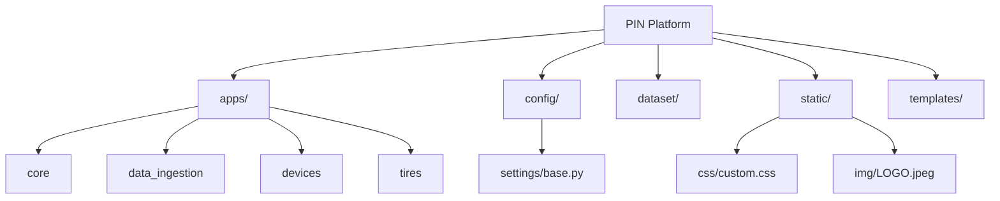

# 🏗️ FASE 1: Estructura Base y Configuración

## 🎯 Objetivo de la Fase
Establecer los cimientos del proyecto PIN Platform. Esto incluyó la creación del esqueleto de Django, la configuración de variables de entorno, la preparación para integraciones geoespaciales y la arquitectura de aplicaciones (`apps/`).

## 🛠️ Logros y Componentes Construidos

1. **Estructura Modular de Django**: 
   - Se configuró el proyecto para usar un directorio de `apps/` aislando la lógica del negocio.
   - Archivos de configuración divididos (`base.py`, `dev.py`, `prod.py`).

2. **Manejo de Entorno Virtual y Dependencias**:
   - `requirements.txt` actualizado con librerías críticas: Django, Pandas, Openpyxl, Leaflet.

3. **Arquitectura Frontend Base**:
   - Sistema de plantillas configurado (`templates/base.html`).
   - Implementación de **Glassmorphism** y un sistema nativo de cambio de tema (Claro/Oscuro) en CSS.

## 📊 Arquitectura de Carpetas (Diagrama)

## 📸 Evidencia Visual

> **[ 🖼️ ESPACIO PARA IMAGEN: Captura de pantalla de la estructura de carpetas en VS Code o la pantalla de inicio del framework Django ]**

---
*Fase completada y auditada según el documento maestro.*