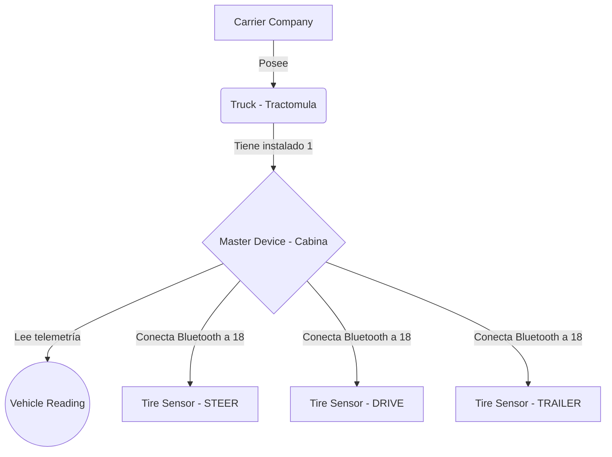

# 📡 FASE 3: App Devices - Gestión de Dispositivos (IoT)

## 🎯 Objetivo de la Fase
Establecer la arquitectura digital del hardware IoT (Internet de las Cosas) que operará dentro de las tractomulas, mapeando la relación física entre el vehículo, la computadora central en cabina y los sensores esclavos en cada llanta.

## 🛠️ Logros y Componentes Construidos

1. **Modelo `Truck` (Tractomula)**:
   - Registro de placa, VIN, marca y compañía transportista.
   - Seguimiento del estado activo y última ubicación conocida.

2. **Modelo `MasterDevice` (Dispositivo Maestro)**:
   - Representa la CPU en cabina.
   - Vinculación `OneToOne` con `Truck`.
   - Control de métricas críticas: Nivel de batería (%), Fuerza de señal 4G/5G (dBm), Versión de Firmware.

3. **Modelo `TireSensor` (Sensor Esclavo por Llanta)**:
   - Soporte estricto para las 18 posiciones de un camión Clase 8 (FL-1, RL-4, TR-2, etc.).
   - Relación con el dispositivo maestro.
   - Monitoreo del kilometraje acumulado por sensor.

4. **Modelo `VehicleReading`**:
   - Estructura para recibir el "latido" (ping) telemétrico del vehículo: Velocidad, RPM, Acelerómetro (para frenazos) y coordenadas en tiempo real.

## 📊 Arquitectura de Hardware (Modelo de Datos)

## 📸 Evidencia Visual

> **[ 🖼️ ESPACIO PARA IMAGEN: Captura de pantalla del código de `apps/devices/models.py` o de la consola ejecutando las migraciones de estos modelos ]**

---
*Fase completada y auditada según el documento maestro.*