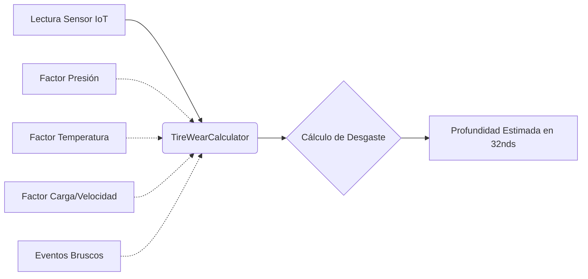

# 🛞 FASE 4: App Tires (Desgaste) y 🗺️ Mapa Operativo

## 🎯 Objetivo de la Fase
Esta fue la fase más extensa y compleja. El objetivo se dividió en dos grandes frentes: 
1. **IoT Llantas:** Implementar las fórmulas físicas para predecir el desgaste de las llantas basándose en variables telemétricas.
2. **Mapa Analítico (Desarrollo adelantado):** Construir el mapa interactivo de alto rendimiento para visualizar toda la infraestructura de EE.UU. disponible para los conductores.

## 🛠️ Logros y Componentes Construidos

### 1. Motor de Desgaste (App Tires)
- **Modelos Creados**: `TirePositionConfig` (Reglas de profundidad legales por FMCSA), `TireReading` (Presión, Temp, Vibración en vivo), y `TireMaintenanceLog`.
- **Fórmula Híbrida**: Se creó el motor `wear_formulas.py` que calcula el desgaste usando **10 factores de ajuste físicos** (Velocidad, Temperatura, Sobrecarga, Frenazos, etc.).

### 2. Mapa Interactivo de Alto Rendimiento
- **Motor Gráfico**: Transición de SVG a HTML5 Canvas (`preferCanvas: true`) para renderizar millones de coordenadas sin congelar el navegador.
- **Manejo de Rutas NHS**: Algoritmo para cargar un GeoJSON masivo (68 MB comprimido) coloreando las rutas por tipo (Interestatales, Nacionales).
- **Spiderfy y MarkerCluster**: Algoritmos para agrupar marcadores lejanos y separar en forma de "telaraña" múltiples servicios que comparten la misma coordenada (Ej: Duchas y Restaurantes en la misma gasolinera).
- **Extracción de Franquicias**: ETL modificado para leer y extraer nombres específicos de más de 140 restaurantes ocultos en los datasets de Pilot, Love's y TA.
- **Capa de Rugosidad Vial**: Se añadió una superposición temática para representar la severidad de rugosidad por tramo, usando referencia HPMS/IRI y una simbología diferenciada de la flota.

### 3. Ampliación: Rugosidad de Carretera como Analítica Operativa

La rugosidad de carretera se incorporó como una dimensión de análisis porque afecta directamente el desempeño de las tractomulas y el sistema PIN:

- incrementa el esfuerzo mecánico sobre suspensión, ejes y llantas;
- aporta contexto al análisis de desgaste y mantenimiento preventivo;
- permite identificar corredores menos favorables para operación continua;
- mejora el valor del mapa al pasar de una visualización de ubicaciones a una lectura de condición vial.

#### Qué se hizo técnicamente

- Se desacopló la capa de rugosidad del movimiento de los vehículos para evitar que pareciera una línea que "se dibuja" con la flota.
- Se reorganizó la visualización para que la rugosidad cargue como capa completa del mapa.
- Se definió una simbología por severidad para diferenciar claramente el estado del corredor respecto a las demás capas operativas.
- Se dejó preparada la integración con HPMS/IRI y fallback sobre la red vial disponible cuando no existe cobertura geométrica completa.

#### Resultado de la fase

El mapa operativo quedó evolucionado desde una vista de infraestructura y servicios hacia una vista analítica del corredor, donde ya no solo se observan rutas y amenidades, sino también condiciones del pavimento relevantes para la operación del transporte pesado.

## 📊 Diagrama Lógico de la Fórmula de Desgaste

## 📸 Evidencia Visual

> **[ 🖼️ ESPACIO PARA IMAGEN 1: Captura del Mapa Operativo en Modo Oscuro mostrando la separación de marcadores Spiderfy (Truck Stops, Restaurantes, Duchas) ]**

> **[ 🖼️ ESPACIO PARA IMAGEN 2: Captura del recuadro emergente (Popup) mostrando la cantidad de islas diésel y los chips naranjas de los restaurantes específicos ]**

> **[ 🖼️ ESPACIO PARA IMAGEN 3: Captura del mapa con la capa de rugosidad activa, mostrando tramos coloreados por severidad y la diferencia visual frente a la capa de flota ]**

---
*Fase completada y auditada según el documento maestro.*
