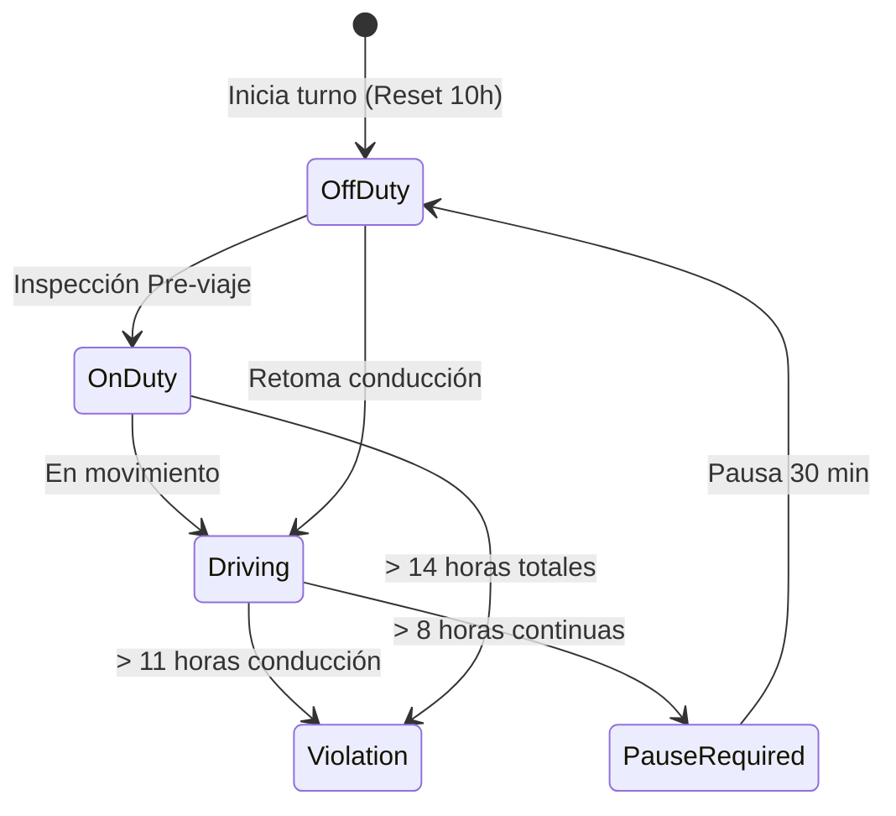

# ⏱️ FASE 5: App HOS Monitoring (Hours of Service)

## 🎯 Objetivo de la Fase
Implementar el cumplimiento normativo federal de Estados Unidos respecto a las Horas de Servicio (HOS) de los conductores, basado en las regulaciones de la FMCSA (Federal Motor Carrier Safety Administration) 49 CFR Part 395.

## 🛠️ Logros y Componentes Construidos

1. **Modelos de Datos (ELD - Electronic Logging Device)**:
   - `Driver`: Información del conductor y su licencia CDL.
   - `DriverLog`: Bitácora electrónica que registra el estado del conductor (Driving, On-Duty, Off-Duty, Sleeper Berth) vinculada a una coordenada y una tractomula.
   - `HOSCompliance`: Tabla resumen de alto rendimiento que acumula los minutos conducidos diarios y semanales para evaluar si el conductor está violando la ley.
   - `HOSAlert`: Registro de advertencias y violaciones críticas para notificar a la empresa transportista.

2. **Motor de Reglas Federales (`fmcsa_rules.py`)**:
   - Implementación estricta de los límites:
     - **Regla de 11 Horas**: Máximo tiempo de conducción.
     - **Regla de 14 Horas**: Ventana máxima "On-Duty".
     - **Pausa de 30 Minutos**: Obligatoria tras 8 horas de manejo.
     - **Límites de Ciclo**: 60 horas en 7 días o 70 horas en 8 días.
   - Soporte para la excepción de *Condiciones Adversas* (+2 horas de gracia).

3. **Motor de Cálculo (`services.py`)**:
   - Construcción del `HOSCalculator` que procesa el cumplimiento (`check_compliance`) y detona alarmas automáticas preventivas (`generate_hos_alerts`) 60 minutos antes de que un conductor viole la ley.

## 📊 Diagrama de Flujo (Reglas HOS)

## 📸 Evidencia Visual

Se implementó el Dashboard Gerencial Frontend con diseño Glassmorphism, que permite auditar en tiempo real:
- Barras de progreso de las Reglas FMCSA (11H, 14H, 70H).
- Panel lateral para notificaciones de Alertas Críticas de Violación o Advertencia.
- Se conectó un sistema de datos simulados `mock_fleet` para inyectar "ELD Logs" ficticios para pruebas comerciales.

---
*Fase 5 completada y auditada según el documento maestro.*