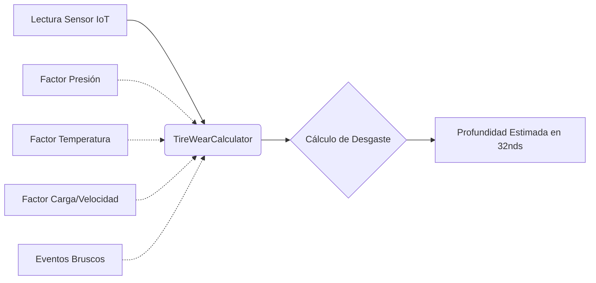

# 🛞 FASE 4: App Tires (Desgaste) y 🗺️ Mapa Operativo

## 🎯 Objetivo de la Fase
Esta fue la fase más extensa y compleja. El objetivo se dividió en dos grandes frentes: 
1. **IoT Llantas:** Implementar las fórmulas físicas para predecir el desgaste de las llantas basándose en variables telemétricas.
2. **Mapa Analítico (Desarrollo adelantado):** Construir el mapa interactivo de alto rendimiento para visualizar toda la infraestructura de EE.UU. disponible para los conductores.

## 🛠️ Logros y Componentes Construidos

### 1. Motor de Desgaste (App Tires)
- **Modelos Creados**: `TirePositionConfig` (Reglas de profundidad legales por FMCSA), `TireReading` (Presión, Temp, Vibración en vivo), y `TireMaintenanceLog`.
- **Fórmula Híbrida**: Se creó el motor `wear_formulas.py` que calcula el desgaste usando **10 factores de ajuste físicos** (Velocidad, Temperatura, Sobrecarga, Frenazos, etc.).

### 2. Mapa Interactivo de Alto Rendimiento
- **Motor Gráfico**: Transición de SVG a HTML5 Canvas (`preferCanvas: true`) para renderizar millones de coordenadas sin congelar el navegador.
- **Manejo de Rutas NHS**: Algoritmo para cargar un GeoJSON masivo (68 MB comprimido) coloreando las rutas por tipo (Interestatales, Nacionales).
- **Spiderfy y MarkerCluster**: Algoritmos para agrupar marcadores lejanos y separar en forma de "telaraña" múltiples servicios que comparten la misma coordenada (Ej: Duchas y Restaurantes en la misma gasolinera).
- **Extracción de Franquicias**: ETL modificado para leer y extraer nombres específicos de más de 140 restaurantes ocultos en los datasets de Pilot, Love's y TA.

## 📊 Diagrama Lógico de la Fórmula de Desgaste

## 📸 Evidencia Visual

> **[ 🖼️ ESPACIO PARA IMAGEN 1: Captura del Mapa Operativo en Modo Oscuro mostrando la separación de marcadores Spiderfy (Truck Stops, Restaurantes, Duchas) ]**

> **[ 🖼️ ESPACIO PARA IMAGEN 2: Captura del recuadro emergente (Popup) mostrando la cantidad de islas diésel y los chips naranjas de los restaurantes específicos ]**

---
*Fase completada y auditada según el documento maestro.*